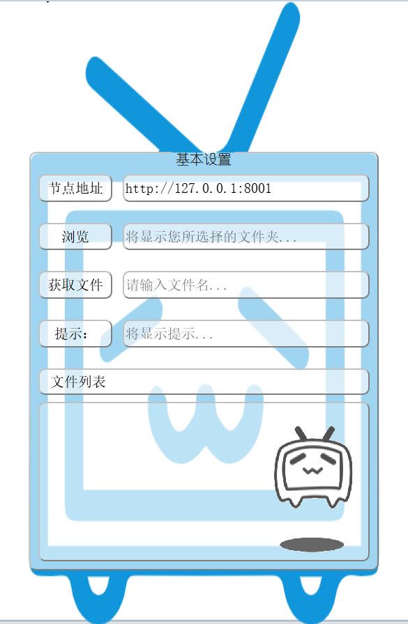

# PyQt项目练习

## Bilibili-XML-RPC
* 基于《Python基础教程》项目8：使用XML-RPC共享文件，项目9：使用GUI共享文件
* 程序采用Pyqt制作，由于pyqt采用GPLV3协议，所以这部分内容遵循为GPLV3协议。
* 效果

* 主要技术可参看《python基础教程》关于XML-RPC客户端的描述。
* 主要的部分为程序美化。无边框，透明背景，蒙皮。

## 赞助
* 如果你觉得这个项目帮助了你，可以赞助我一包辣条。

（随缘，虽然项目很难被发现，不过还是填上去，万一真的有人赞助呢）

